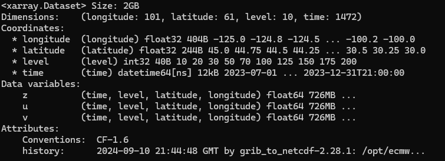
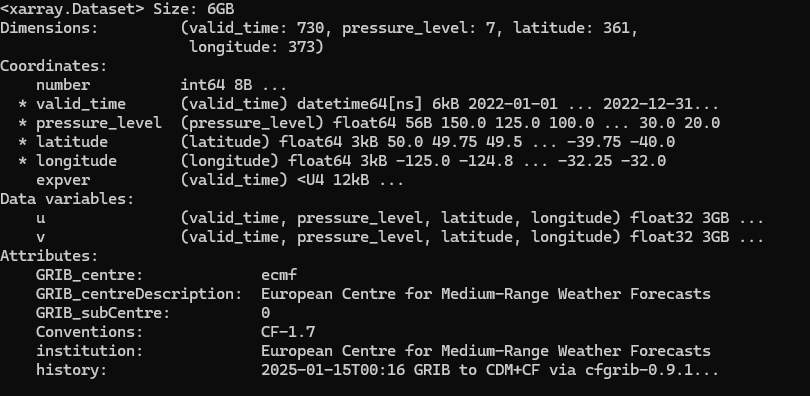
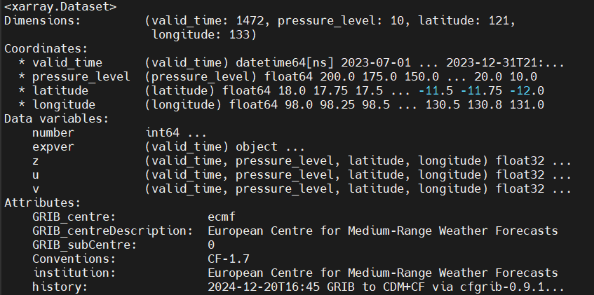

# ERA5-Utils
> Utilities to preprocess ERA5 forecast data into clean, consistent formats for modeling, machine learning, or climate analysis.

`ERA5-Utils` is a toolkit for downloading, processing, and converting 4D ERA5 reanalysis forecast data into standardized formats for use in modeling, atmospheric simulations, and reinforcement learning environments. It supports [ECMWF ERA5](https://www.ecmwf.int/en/forecasts) reanalysis forecasts in both pressure-level and model-level data (Complete ERA5) and includes utilities for converting hybrid sigma-level NetCDF/GRIB files to pressure or altitude levels. Designed for geoscience workflows, this package automates and streamlines common preprocessing steps using ECMWF's CDS API, Climate Data Operators (CDO), and Python tools like xarray.  Currently focused on atmospheric data, this repo supports preprocessing of temperature, humidity, wind, and geopotential fields for use in Earth system models, stratospheric balloon simulations, and custom analysis workflows.  In the future we would like to add support for [GFS](https://www.ncei.noaa.gov/products/weather-climate-models/global-forecast) and [ICON](https://www.icon-model.org/)

Some of our simulation frameworks that use this include:
- [RL-HAB](https://github.com/USNavalResearchLaboratory/RL-HAB)
- [RadioWinds](https://github.com/tkschuler/RadioWinds)
- [EarthSHAB](https://github.com/tkschuler/EarthSHAB)

> **ℹ️ Note** From September 26, 2024, the [legacy CDS and legacy ADS](https://confluence.ecmwf.int/display/CKB/Please+read%3A+CDS+and+ADS+migrating+to+new+infrastructure%3A+Common+Data+Store+%28CDS%29+Engine) are decommissioned and no longer accessible.
CDS-Beta and ADS-Beta have officially become the new CDS and the new ADS. The new CDS and ADS also use an [updated GRIB to netCDF conversion](https://confluence.ecmwf.int/display/CKB/GRIB+to+netCDF+conversion+on+new+CDS+and+ADS+systems), which causes slight differences in both formatting and data. An ERA5 Reanalysis forecast downloaded for identical regions Pre and Post Sep 2024, will have slightly different variable numbers as well as some differences in strucure.

## Installation
This package is designed to work on **Ubuntu**, **WSL**, or any Unix-like system with climate data tools.

    pip3 install -r requirements.txt

Additional command line netcdf tools to install on local machine:
* conda install [cdsapi](https://confluence.ecmwf.int/display/CKB/How+to+download+ERA5)
* `sudo apt-get install netcdf-bin`
* `sudo apt-get install nco`
* [Climate Data Operator (CDO) command line tool](https://www.isimip.org/protocol/preparing-simulation-files/cdo-help/)
  * [CDO User Guide](https://scicomp.ethz.ch/public/manual/CDO/1.6.4/cdo.pdf)

## ERA5 Reanalysis Data Structures
There are three primary sources for downloading ERA5 Data:
* Pre Sep-2024 Climate Data Store
* [Post Sep-2024 Climate Data Store](https://cds.climate.copernicus.eu/datasets/reanalysis-era5-pressure-levels?tab=download)
* [Complete ERA5 data on model levels](https://cds.climate.copernicus.eu/datasets/reanalysis-era5-complete?tab=d_download)
  * Also see: (https://confluence.ecmwf.int/display/CKB/ERA5%3A+data+documentation)

Each data source formats and structures the multi-dimensional data in slightly different ways.  We prefer the Pre-Sep 24 format, as many of our other codebases were built using this structure, it's faster, and doesn't include any unecessary coordinates or  variables. 

### Data Structure Variations between Data sources:
The following outputs in command line were generated using `explore_netcdf.py`
(Note: the screenshots below are not from the exact same regions/timeframes). 

**Pre Sep 2024 ERA5 data structure:**

**Post Sep 2024 ERA5 data structure:**

**ERA5-Complete data structure:**

### Differences between Pre and Post September 2024:
* Post introduces `expver` and `number` coordinates which we remove. (see below what these do)
* `time` was renamed to `valid_time`
* `level` was renamed to `pressure_level` and changed from `type:int32` to `type:float64`
* `latitude` and `longtiude` were changed from `type:float32` to `type:float64`
* *Data variables* were changed from `type:float64` to `type:float32`
* A hidden difference is that Pre-Sep-24-ERA5 is `type:64bit offset` format while Post-Sep-24-ERA5 is `type:NETCDF4`
  * This can be checked using `ncdump -k your_file.nc`
  * `NetCDF-3` (64-bit offset) stores data contiguously, typically making sequential reads faster. Whereas `NetCDF-4`
  chunks data, meaning that accessing small portions of large datasets can be slower due to extra read operations.
* [See Unidata for differences in backend netcdf filetypes](https://www.unidata.ucar.edu/software/netcdf/workshops/2012/performance/FormatVersions.html)
  
(I thought there was a difference in Lat order and/or Long degrees?)

### Differences between Pre September 2024 and processed Complete ERA5 converted to pressure levels (see tutorial below):
* `level` was renamed to `plev` and changed from `type:int32` to `type:float64`
* `level` is 100 x larger (mb to Pa)
* `latitude` and `longtiude` were renamed to `lat` and `lon`
* `latitude` and `longtiude` were changed from `type:float32` to `type:float64`
* *Data variables* were changed from `type:float64` to `type:float32`
*  `longtiude` range is changed from (-180, 180) to (0,360)

> **ℹ️ Note on removed variables `expver` and `number`:**  
> - `expver` stands for "experiment version" and is used by ECMWF to differentiate between different dataset versions. In ERA5, this typically indicates whether the data comes from the **main** ERA5 dataset (`expver=0001`) or the **back extension** (`expver=0005`), which covers earlier years before 1979.  
> - The `number` coordinate is used in **ensemble datasets** where multiple forecasts are run with slightly different initial conditions. In ERA5, `number=0` typically refers to the **deterministic (high-resolution)** reanalysis. If you're using the **ERA5 ensemble mean (ERA5T)**, `number` will range from 0 to 9 (10 ensemble members).

### Convert Post and Complete to Pre Sep 2024 netcdf4 formatting
If ERA5 Post Sep 2024 on pressure levels has been downloaded, run `post2pre.py` and change the filename arguments.

If ERA5-Complete is already download and converted to pressure levels (See below on tutorial), run `complete2pre.py` and change the filename arguments.

---

## Downloading ERA5 Reanalysis on pressure levels:
Download [ERA5 hourly data on pressure levels from 1940 to present](https://cds.climate.copernicus.eu/datasets/reanalysis-era5-pressure-levels?tab=download) from the ECMWF CDS with desired coordinates and variables.

## Downloading Complete ERA5 Reanalysis on Model Levels and converting to pressure levels:
The complete ERA5 reanalysis on model levels provides atmospheric data on the model’s native hybrid sigma-pressure vertical coordinate system, offering higher vertical resolution and more physically consistent fields, particularly near the surface and tropopause. Unlike pressure level data—which is interpolated post-processing onto standard pressure surfaces (e.g., 850 hPa, 500 hPa)—model level data is reported on 137 hybrid levels that transition from terrain-following sigma coordinates near the surface to pressure-based levels higher in the atmosphere. This hybrid system more accurately represents topographically complex regions and ensures mass conservation in vertical transport, making it especially valuable for research involving vertical dynamics, surface–atmosphere interactions, and numerical modeling.

However, the hybrid-sigma structure is not good for altitude/depth based simulations or analysisis. So we convert model levels back to pressure levels or altitude levels, which requires at minimum the following 4 variables and 2 different output files: 

* z (geopotential) and lnsp (log surface pressure) only at surface level (model level 1)
* t (temperature), q (humidity), and any other desired params at all model levels of interest (can be 1-137)

> **ℹ️ Note** While all 4 of these variables can technically be downloaded at the same time, issues arise durring netcdf     processing altitude or pressure levels since params *z* and *lnsp* only contains data at model level 1.

Before downloading, update `config.py` with desired params (see provided file for examples)
* **tp** should be an for analysis or "fc" for a forward forecast
* **date** can be an individual date or range of dates
* **time** can be 1 hour increments for reanalysis" and either "00:00:00/12:00:00" for forward forecasts
* **grid** 
  * 0.25° (HRES)
  * 0.1° (ERA5-Land)
  * 0.5° (ERA5 Ensemble [EDA])
  * You can technically request coarser resolution (e.g. 1.0° x 1.0°),but not higher than the native grid. 
* **area** [North, West, South, East] lat (-90 to 90), lon (-180, 180)
* **levellist** 1-137 (all levels required to have embedded hybrid sigma information)
* **param** See [ERA5 data documentation](https://confluence.ecmwf.int/display/CKB/ERA5%3A+data+documentation#ERA5:datadocumentation-Parameterlistings) for available *param short names*
* **step** up to 0-18 hours for *forward forecasts*

#### Additional Resources from ECMWF
* Produce and verify the [MARS CDS API request](https://apps.ecmwf.int/data-catalogues/era5/?class=ea)
* [Model Level Definitions](https://confluence.ecmwf.int/display/UDOC/Model+level+definitions)
* [L137 Model Level Definitions](https://confluence.ecmwf.int/display/UDOC/L137+model+level+definitions)

`compute_geopotenial_on_ml_updated.py` and `conversion_from_ml_to_pl_updated.py` have both been updated from the [scripts provided by ECMWF](https://confluence.ecmwf.int/display/ECC/Compute+geopotential+on+model+levels) to compute geopotential on model levels which both have [reported bugs](https://forum.ecmwf.int/t/bugs-in-era5-complete-reanalysis-cds-conversion-python-scripts/10696). 

We have found the output of `conversion_from_ml_to_pl_updated.py` to be less accurate when compared against ECMWF reanalysis forecasts on pressure levels, and also significantly slower to calculate than using CDO's *ml2pl* command. 

### Bash Scripts for Easy Monthly and Annual Processing:
`process-complete-ERA5.sh` gives a quick example on how to download and convert raw complete ERA5 reanalysis on model levels to higher resolution pressure levels. Alternatively cdo's *ml2al* command can be used in *ml2pl* place of  can be used to convert to altitude instead of pressure levels. 

`aggregate-annual-complete-ERA5.sh` runs `process-complete-ERA5.sh` for every month in a user defined year to make a final annual Complete ERA5, outputting in both grib and netcdf format 

**Steps for the bash script (per month due to 10Gb download limit)**
1. Download data. Set the `config` params first (`download_Complete_ERA5.py`)
2. compute geopotential (python3 `compute_geopotential_on_ml_updated.py tq_ml2.grib zlnsp_ml.grib -o z.grib`)
3. remove z from lnsp before merge, since only at level 1, and not to conflict with new z (`cdo delname,z zlnsp_ml.grib lnsp.grib`)
4. Merge z, lnsp, and tq_ml2 for monthly forecast with all variables (`cdo merge tq_ml2.grib z.grib lnsp.grib Jan-2022.grib`)
5. Convert to new user_defined pressure levels (`cdo ml2l...`)
6. Remove uncessary variables (`cdo delname,q,t,lnsp Jan-2022_pres_temp.grib Jan-2022_pres.grib`)
7. Remove all intermediate processing files. (`rm Jan-2022_pres_temp.grib,z.grib, lnsp.grib`)

## Additional Scripts for fomatting and proccessing:
* `check_corruption.py` Gives an example on how to check if a netcdf4 forecast is corrupted. Often, when a netcdf4 file is corrupted, the file can still be imported properly and not throw any errors, but causes problems later hwne trying to access the data. 
* `explore_netcdf.py` examine the output of a processed netcdf using python's xarray library
* `split.py` gives an example on how to subset a larger forecast to a smaller region and/or timescale

## Authors
* Tristan Schuler - U.S. Naval Research Laboratory

# Tips/Tricks
  * Grib files are smaller than netcdf file, by almost half.
  * The hybrid sigma variables are only present if full model level list is downloaded
  (potentially will work if surface pressure is included for a subset of levels?)
  * You can't combine multi level geopotential data (z) with a single surface level z file, they interfere

## TODO:
* Clean and Fix Forward Forecast processing
* Write a script that autochecks differences between formats
* GFS Support